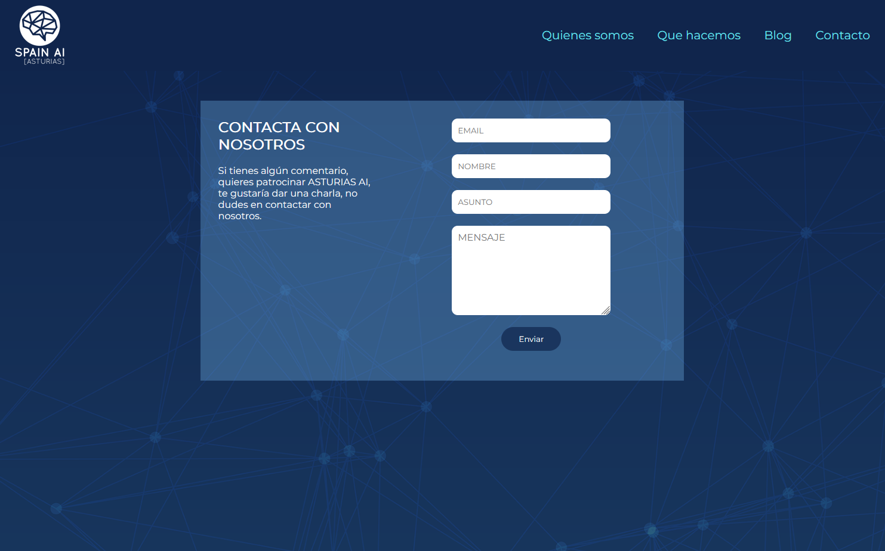

# ASTURIAS AI

¡Presentamos *ASTURIAS AI*:

Web diseñada para Patricia(Patri) Acebes Tamargo🦄 para ASTURIAS AI.

Nuestra misión:

    Crear una página web principal con los colores y estilos que necesita Patricia.
    Brindar una plataforma de blog para la subida de archivos y información.
    Construir una newsletter para enviar la información a los subscriptores.
    Creación de un formulario de contacto y envio a email.


# git branches
   


| BRANCH   | Description                                                                           |
| -------- | ------------------------------------------------------------------------------------- |
| main     | Rama principal. Aquí alojamos solo los resultados finales de cada historia de usuario |
| Header   | Rama creada para la creación del Header independientemente                            |
| QuienesSOmos | Rama de creacion del componente Quienes Somos                                     |
| card | Rama de desarrollo para las card 1.0 del blog                                             |
| deploy  | Rama para implementar el deploy del envio del formulario del contacto                  |


#  Descripción del proyecto
Nos han pedido que hagamos una página web para sacar a producción de la manera mas economica y coherente posible.


🛠️ Las funcionalidades básicas que cubre la aplicación web son las siguientes:
- Publicar un post en el blog a traves de contentful
- Poder visualizar todos los articulos del blog.
- Poder suscribirte a traves de substack a la newsletter.
- Poder enviar un formulario de contacto con tus datos a un correo de ASTURIAS AI.
- Tener la posibilidad de conocer a que se de decica y conocer a los colaboradores de ASTURIAS AI.
- Enlazar a cualquier usuario a las redes sociales, podcast y youtube de ASTURIAS AI


## Tecnologías utilizadas


 

# Planificación
Hemos utilizado Mural para crear tableros donde tener accesibles todos los documentos de planificación: historias de usuario, kanban y funciones.

[Ver TABLERO DE PLANIFICACIÓN ](https://app.mural.co/t/personal2568/m/personal2568/1712048938425/259aafd438798d4db2ddb1f5a8845bb3b83a2a37?sender=u08685b71ed5a8f53509b3340)

## Equipo de desarrollo

### Oli Casiano - Product Owner 
- https://www.linkedin.com/in/olicasiano/


### Herminio - Scrum Master
- linkedin.com/in/herminio-castro-riveira


### Eva Maria - Equipo Desarrollo
- https://www.linkedin.com/in/eva-maria-velasco-casta%C3%B1on/


### Maria - Equipo Desarrollo
- https://www.linkedin.com/in/mfg1985


### Iciar - Equipo Desarrollo
- https://www.linkedin.com/in/iciarrodriguezgomez/


### Ana Mari - Equipo Desarrollo
- https://www.linkedin.com/in/ana-mari-fern%C3%A1ndez-men%C3%A9ndez-61586528a/


# Instalación
## Pasos para inicializar la aplicación y requisitos necesarios.

- Para poder inicializar el proyecto necesitaremos un editor de codigo fuente, por ejemplo VS CODE:
https://code.visualstudio.com/download

- Necesitaremos movernos a la carpeta Frontend y realizar los siguiente comandos:

``` npm install  ```
``` npm install @formspree/react ```
``` npm install -g contentful-cli ```

 Tendras que crear una cuenta en :
 - https://substack.com/ " Para el enlace de la Newsletter "
 - https://www.contentful.com/ " Para en enlace de blogs por CMS "
 - https://formspree.io/ " Para el enlace del formulario de contacto y la recepción a un correo propio "

## Vistas de la aplicación

Pagina principal con enlaces a Redes sociales en el mapa.

Vista del componente Quienes Somos en la página principal.

Vista de Que Hacemos en la página principal.

Vista Página Blog

Vista Formulario de Contacto
